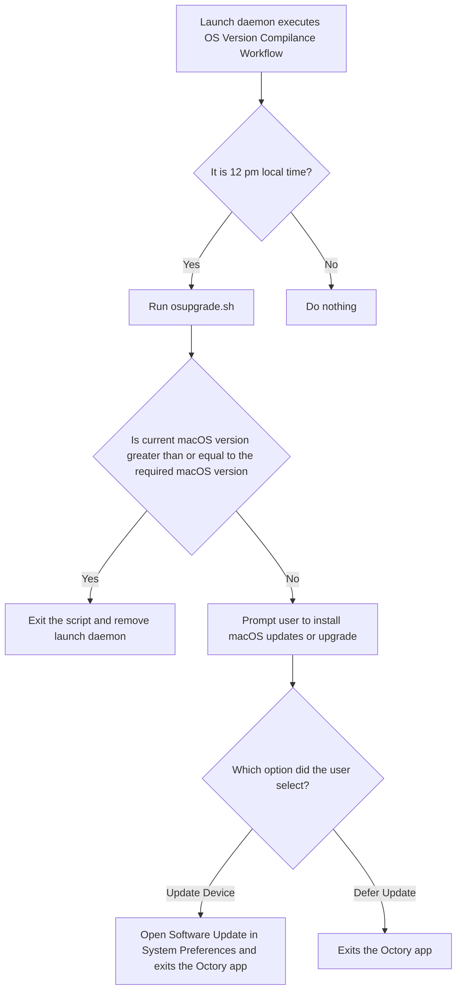

# OS Version Compliance Workflow
The OS Version Compliance Workflow guarantees that all macOS device managed by Jamf Pro MDM adheres to Foursquare’s minimal operating system version requirements.

It uses the following components: scout binary, gsort binary, Octory app, Octory CLI notifier binary, Octory privilege helper tool, Octory resources, and Apple launch daemons for Octory privilege helper and Octory app.

These components are bundled into an installation package.

Upon successful installation, the package will execute the osupgrade.sh shell script. This script uses the scout binary to determine the required OS version derived from the Octory app plist file. Then, it uses the gsort binary to compare the required OS version to the current OS version. If the current version is lesser than the required version, the user will be prompted to perform an OS update/upgrade. If the current version is compliant, the shell script exits silently, and the Apple launch daemon components are removed from the macOS device.

## Diagram


## Build Instructions
```console
sudo ./build_pkg.sh "Software Update Prompt"
```

## Build Directory Structure
### [build](https://github.com/foursquare/it/tree/master/octory/SoftwareUpdatePrompt/build)
Build directory containing your recent package build output files
### [build_pkg.sh](https://github.com/foursquare/it/tree/master/octory/SoftwareUpdatePrompt/build_pkg.sh)
Build script for building your package
### [payload](https://github.com/foursquare/it/tree/master/octory/SoftwareUpdatePrompt/payload)
Payload directory containing the root directory for package 
### [resources](https://github.com/foursquare/it/tree/master/octory/SoftwareUpdatePrompt/resources)
Resources directory contains the requirements plist which allows you specify build requirements for your package
### [scripts](https://github.com/foursquare/it/tree/master/octory/SoftwareUpdatePrompt/resources)
Scripts directory containing scripts for your package
